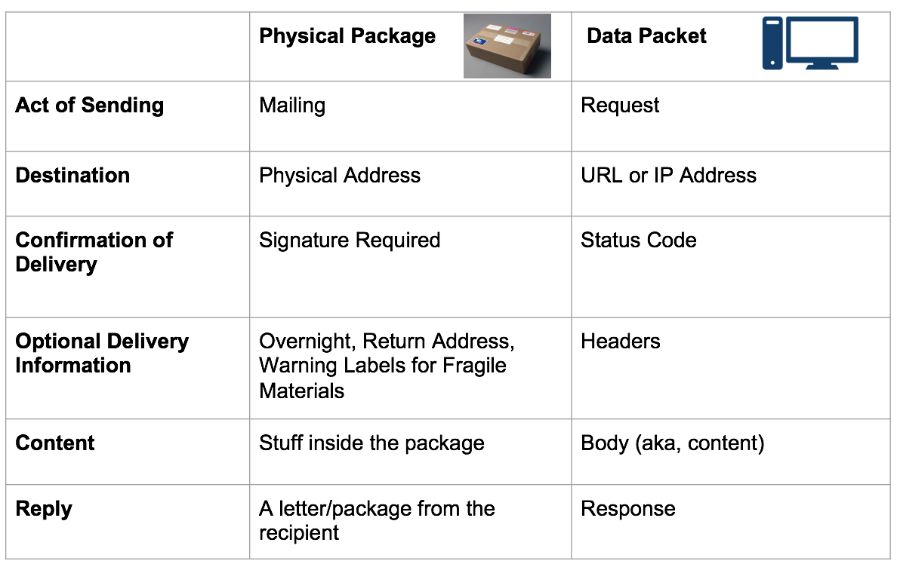

#  Python Workshop: Webscraping and a Few Visualizations

## After this workshop, you'll be able to:

- Gain a broad understanding of HTTP and sending requests
- See a practical demonstration of sending, receiving, and processing requests
- Determine how to parse a webpage to automate data collection 
- See examples and use reproducible code for producing visualization in Python (if time permits!)

## Why?

The core of any data analysis is quality data. Learning how to obtain quality data in an automated fashion is the bedrock of any statistical analysis.

## APIs Overview

In order to talk about APIs, we need first to introduce the concept of _separation of concerns_. In computer science, _separation of concerns_ (SoC) is a design principle for separating a computer program into distinct sections, such that each section addresses a separate concern. For example, when building a web application, the best practice is to separate the website logic from data models. This not only allows for cleaner code, but is an easier way to manipulate our layouts and interactions without having to alter how the models work. Separation of concerns becomes ever more important when working with outside data.

API calls are really a fancy term for making _HTTP requests_ to a server and sending/receiving structured data from that endpoint. We are still communicating with URLs, however instead of receiving markup, like we do with HTML pages, we receive data, in a variety of forms -- JSON, XML, CSV, and others.

[Representational state transfer (REST)](https://en.wikipedia.org/wiki/Representational_state_transfer) is the most common architecture style for passing information to and from these API endpoints.

Before we start consuming these services however, it's important to understand the fundamentals of the underlying communication layer: HTTP.

## HTTP: Overview

HTTP is a protocol - a system of rules - that determines how web pages (see:'hypertext') get sent (see:'transferred') from one place to another. Among other things, it defines the format of the messages passed between HTTP clients and HTTP servers.

Since the web is a service, it works through a combination of clients which _make_ requests and servers (which _receive_ requests).

#### HTTP Client

HTTP Clients make or generate HTTP Requests. Some types of clients are:

* Browsers - Chrome, Firefox and Safari.
* Command Line programs - [curl](http://curl.haxx.se/docs/) and [wget](http://www.gnu.org/software/wget/manual/wget.html).

HTTP Clients respond to HTTP Responses from a Web Server. They process the data being returned from a Web Server.

#### HTTP/Web Server

All _Web Servers_ receive _HTTP Requests_ and generate _HTTP Responses_. Often Web Servers are just the middleman, passing HTTP Request and Responses between the client and web application. Two of the most popular _HTTP or Web servers_ are [Apache](http://httpd.apache.org/) and [Nginx](http://nginx.com/), But there are lots different [web servers](http://en.wikipedia.org/wiki/Comparison_of_web_server_software) out there.

### HTTP + Web Applications

Web Applications are programs that run on a web server, process the HTTP requests that the server receives, and generate HTTP Responses.

Lost? Here's the play-by-play.

1. A client sends a HTTP Request to a HTTP Server running on a remote machine.
  * The _hostname_ given in the URL, indicates which server will receive the request.
2. The HTTP server processes the HTTP Request. This may entail passing the request to some Web Application, which creates a HTTP Response.
3. The response gets sent back to the client.
4. The client processes the response.

How does the server know what the request is asking for? This is specified by the URL, a special kind of path that specifies where a resource can be found on the web.

**[Status Codes](http://en.wikipedia.org/wiki/List_of_HTTP_status_codes)** have standard meanings; here are a few.
>
|Code|Reason|
|:---|:-----|
|200| OK
|301| Moved Permanently
|302| Moved Temporarily
|307| Temporary Redirect
|400| Bad Request
|403| Forbidden
|404| Not Found
|500| Internal Server Error

## Good summary: Packets vs packages

## OMDB API Example

We'll walkthrough how sending a request works by making use of the OMDB API.

Visit the OMDB API page [here](www.omdbapi.com).

Grab this [code]((./code/api-usage-example.py)) or follow along.

## Deconstructing www.stats.hockeyanalysis.com

Brian will walkthrough how to identify elements.

His code is available [here](https://github.com/josephofiowa/dekegeek/blob/master/boshac16/code/scraping_example.py).

## Visualization Examples

The code we discussed to make visualization is available [here](./code/visualization-demo.py).

## ADDITIONAL RESOURCES

- [Blog post on json with pandas](https://www.dataquest.io/blog/using-json-data-in-pandas/)
- [API article Wikipedia](https://en.wikipedia.org/wiki/Application_programming_interface)
- [Programmable web](http://www.programmableweb.com/)